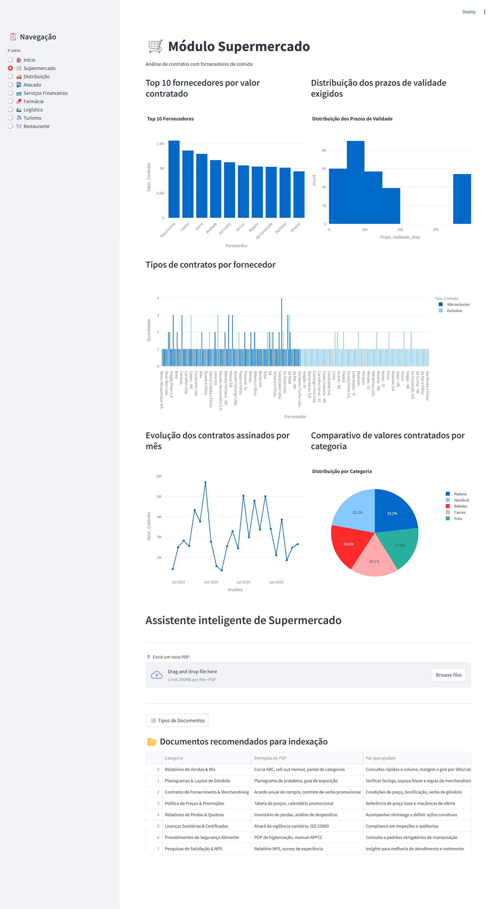
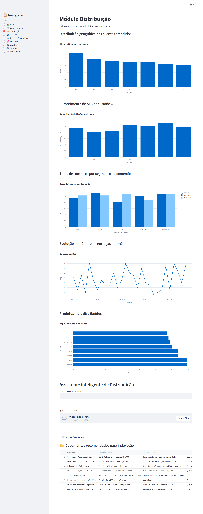
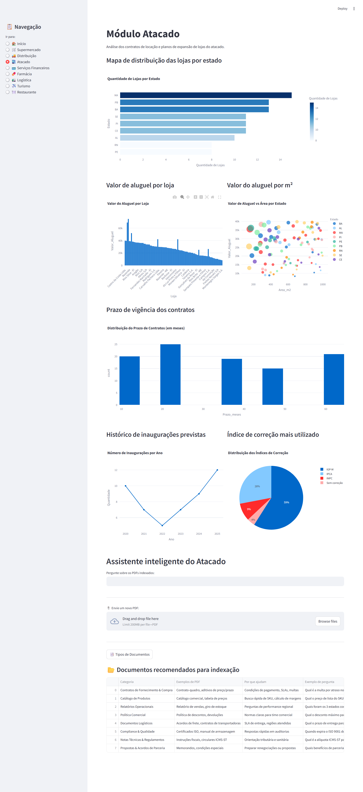
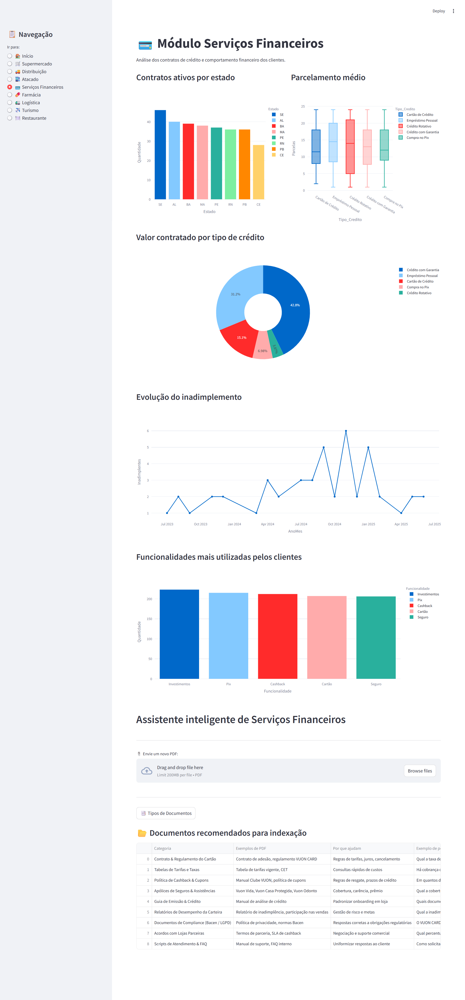
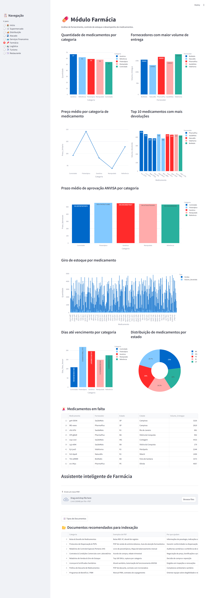
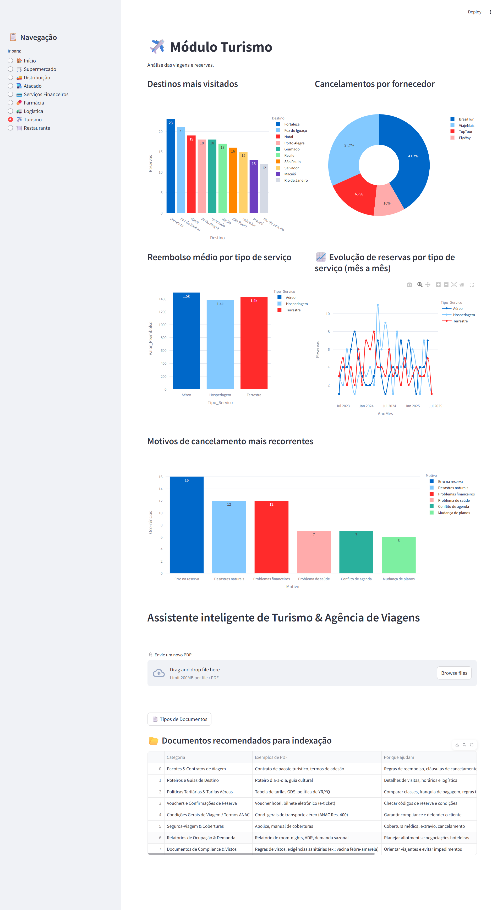
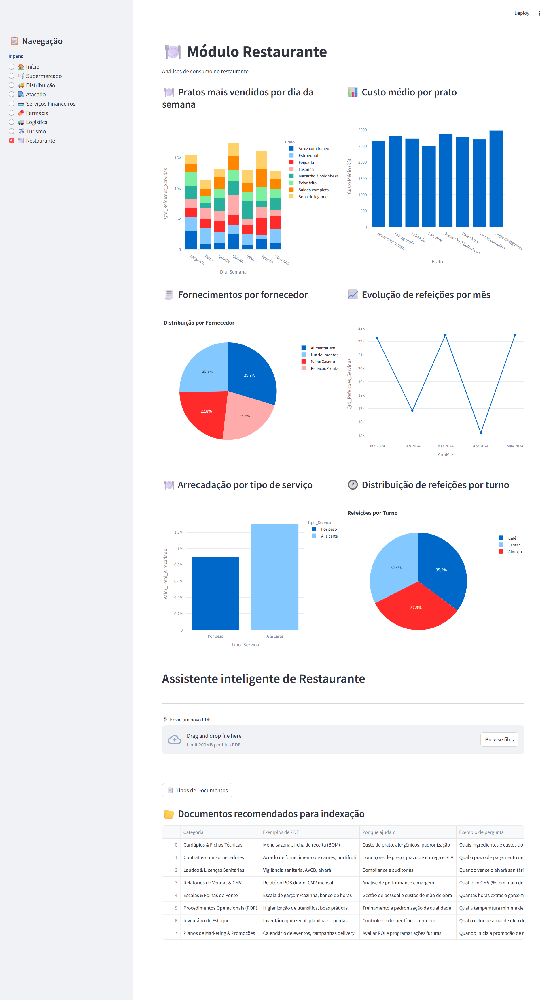

# Universal System 🚀

**Universal System** é uma plataforma modular e reutilizável desenvolvida em Python e Streamlit, voltada para análise de dados e integração com inteligência artificial. Seu objetivo principal é atender empresas com múltiplos setores de operação, oferecendo módulos analíticos independentes e personalizáveis.

## 🎯 Objetivo do Projeto

Criar um sistema robusto, escalável e reutilizável, com:
- Estrutura modular com navegação do Streamlit.
- Dashboard interativo por setor (Ex: Supermercado, Logística, Turismo etc).
- Integração futura com RAG (Retrieval-Augmented Generation) para uso de LLMs com dados específicos por módulo.
- Possibilidade de reutilização por outras empresas de segmentos diversos.

## 🗂️ Estrutura Inicial

```
universal_system/
├── app.py                     
├── utils.py 
├── rag_pipeline.py 
├── rag_section.py                  
│                
│
├── .streamlit/
│   └── config.toml             
│   └── secrets.toml            
│
├── modules/
│   ├── supermercado.py
│   ├── distribuicao.py
│   ├── atacado.py
│   ├── serv_financeiros.py
│   ├── farmacia.py
│   ├── logistica.py
│   ├── turismo.py
│   └── restaurante.py
│
├── components/
│   └── sidebar.py           
│
├── auth/
│   └── login.py              
│
├── data/                      
│
└── requirements.txt    
```

## ⚙️ Tecnologias Utilizadas

- **Python 3.12+**
- **Streamlit 1.45+**
- **Pandas 2.3+**
- **LangChain – Cadeia RAG com rastreamento e ferramentas**
- **Docling**
- **FAISS**
- **Claude Sonnet 4 (Anthropic) – LLM principal via API**
- **HuggingFace Embeddings (multilingual-e5-large) – Embeddings semânticos**

## 🚀 Execução Local

```bash
# Ativando ambiente virtual
source .venv/bin/activate  # (Linux/macOS)
.venv\Scripts\activate   # (Windows)

# Instalando dependências
pip install -r requirements.txt

# Executando o app
streamlit run app.py
```

## 🔢 Módulos e Gráficos Sugeridos

### 🛒 1. Supermercado
**Gráficos sugeridos:**
- 📊 Top 10 fornecedores por volume de entrega  
- 📅 Distribuição dos prazos de validade exigidos  
- 🧾 Tipos de contratos por fornecedor (exclusivo / não exclusivo)  
- 📈 Evolução dos contratos assinados por mês  
- 💰 Comparativo de valores contratados por categoria (carnes, hortifruti, padaria)  



### 🚚 2. Distribuição
**Gráficos sugeridos:**
- 📦 Distribuição geográfica dos clientes atendidos  
- ⏱️ Cumprimento de SLA por região  
- 🧾 Tipos de contratos por segmento de comércio  
- 📈 Evolução do número de entregas por mês  
- 📊 Ranking de produtos mais distribuídos  



### 🏬 3. Atacado
**Gráficos sugeridos:**
- 🗺️ Mapa das lojas por estado  
- 💸 Valores de aluguel por loja e por metro quadrado  
- 📅 Prazo de vigência dos contratos de locação  
- 📈 Histórico de inaugurações por ano  
- 🧾 Índice de correção mais utilizado (IGP-M, IPCA, etc.)  



### 💳 4. Serviços Financeiros
**Gráficos sugeridos:**
- 💳 Número de cartões emitidos por estado  
- 📊 Parcelamentos médios por cliente  
- 💰 Valor total contratado por tipo de crédito (compra, seguro, odontológico)  
- 📅 Evolução do inadimplemento mensal  
- 📈 Uso de funcionalidades por cliente (cartão, seguro, odonto)  



### 💊 5. Farmácias
**Gráficos sugeridos:**
- 🧪 Quantidade de medicamentos por categoria (genéricos, controlados, etc.)  
- 📦 Fornecedores com maior volume de entrega  
- 📈 Variação de preço médio por categoria de produto  
- ⚠️ Medicamentos com maior volume de devoluções  
- 📊 Prazo médio de aprovação da ANVISA  



### 🚛 6. Logística
**Gráficos sugeridos:**
- 🚚 Custo médio de frete por rota  
- 📍 Mapa interativo das rotas mais utilizadas  
- 📈 Evolução de entregas por mês  
- ⏱️ Tempo médio de entrega por estado  
- 🧾 Tipos de contrato logístico por modalidade (FTL, LTL, etc.)  


### ✈️ 7. Turismo
**Gráficos sugeridos:**
- 🌍 Top destinos mais vendidos  
- 📊 Taxa de cancelamento por fornecedor  
- 🧾 Média de reembolso por tipo de serviço (aéreo, terrestre, hospedagem)  
- 📈 Evolução de reservas por colaborador/mês  
- 💬 Motivos de cancelamento mais recorrentes (texto categorizado)  



### 🍽️ 8. Restaurante
**Gráficos sugeridos:**
- 🍽️ Pratos mais vendidos por dia da semana  
- 📊 Custo médio por prato (baseado em contratos com fornecedores)  
- 🧾 Número de contratos terceirizados ativos  
- 📈 Evolução de refeições servidas por mês  
- 🧑‍🍳 Distribuição de funções dos colaboradores  



---

### 🧠 Extras para Todos os Setores (Dashboard Principal)
- 🔎 Documentos carregados por setor  
- ⏱️ Tempo médio de resposta do RAG por setor  
- 💬 Consultas mais frequentes  
- 📈 Uso por dia / semana / mês  
- 👥 Colaboradores mais ativos (se login for usado)  

## 🔐 Segurança e Escopo Futuro

- Página de login com autenticação (sem estar no diretório `pages/`).
- Controle de acesso por usuário e setor.
- Dashboard dinâmico com filtros pelo `sidebar.py`.
- Integração com RAG para respostas inteligentes por setor.
- Personalização do tema para cada empresa cliente.

---

## 📄 Licença

Este projeto está sob a licença MIT. Veja o arquivo `LICENSE` para mais detalhes.

---

Desenvolvido com foco em **clean code**, **escalabilidade** e **reutilização**. 😉
